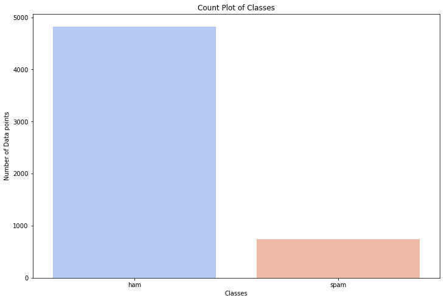
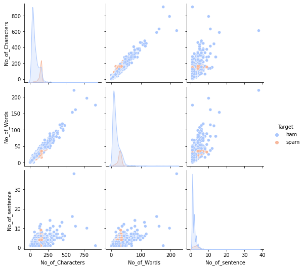
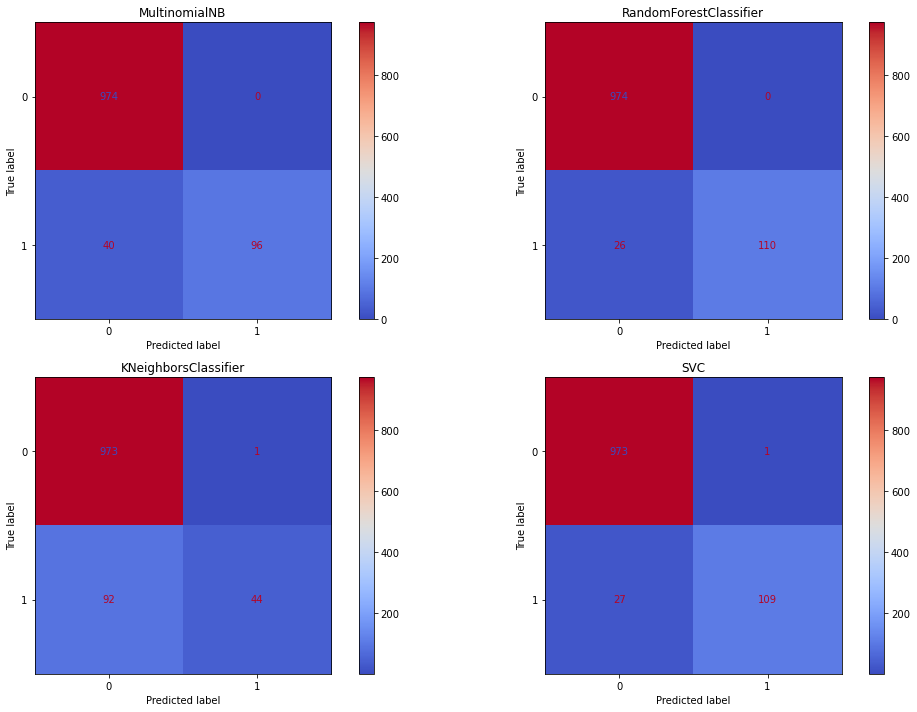

# SpamFilter
## Gannon University
Course project: Statistical Computing

### Loading Data
```
data = pd.read_csv('spam.csv')
data.head()
```

### Data Exploration


### Data Preprocessing
* Cleaning text
* Tokenization
* Removing stopwords
* Lemmatization
* Vectorization



### Model Building
* Naïve Bayes
* RandomForestClassifier
* KNeighborsClassifier
* Support Vector Machines

### Evaluating Models


### Deploying Naïve Bayes Model on Streamlit
```
import pickle
pickle.dump(classifiers[0], open('SpamDetectorModelNB.pkl', 'wb'))
pickle.dump(tfidf, open('Vectorizer.pkl', 'wb'))

ps = PorterStemmer()

def Clean(text):
    sms = re.sub('[^a-zA-Z]', ' ', text) 
    sms = sms.lower() 
    sms = sms.split()
    sms = ' '.join(sms)
    return sms

def Tokenize(text):
    return nltk.word_tokenize(text)

def transform_text(text):
    text = Clean(text)
    text = Tokenize(text)

    text = [i for i in text if i.isalnum()]
    text = [i for i in text if i not in stopwords.words('english') and i not in string.punctuation]
    
    return " ".join([ps.stem(i) for i in text])

tfidf = pickle.load(open('Vectorizer.pkl','rb'))
model = pickle.load(open('SpamDetectorModelNB.pkl','rb'))

if st.button('Predict'):
    transformed_sms = transform_text(input_sms)
    vector_input = tfidf.transform([transformed_sms])
    result = model.predict(vector_input)[0]
    
    if result == 1:
        st.header("Spam")
    else:
        st.header("Not Spam")
```

Visit  my app on streamlit https://share.streamlit.io/epuujee/spamfilter
